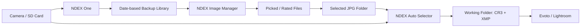

# Program Map

type: architecture-map
updated: 2026-05-25

## Workflow Map

## Program Responsibilities

| Program | Input | Output | Main Value |
| --- | --- | --- | --- |
| [[Programs/NDEX One]] | SD card, camera folder | date-structured backup | 안전한 원본 백업 |
| [[Programs/NDEX Image Manager]] | shooting folder or backup folder | catalog, pick state, selected backup | 선별과 검토 |
| [[Programs/NDEX Auto Selector]] | original CR3 folder + selected JPG folder | working CR3 copies + XMP | 보정 작업용 원본 자동 추출 |

## Data Flow Notes

- NDEX One은 원본 라이브러리를 날짜 구조로 보관하는 1차 백업 도구다.
- NDEX Image Manager는 이미지 확인/평점/선별을 담당한다.
- NDEX Auto Selector는 이미 셀렉된 JPG 파일명을 기준으로 CR3 원본을 찾아 작업 폴더로 모은다.
- XMP는 RAW 파일을 직접 수정하지 않고 Lightroom/Evoto 쪽에서 셀렉 상태를 읽게 하는 안전한 표시 방식이다.

