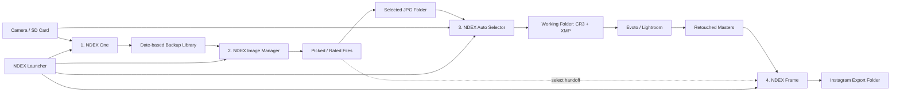

# Program Map

type: architecture-map
updated: 2026-09-02

## Workflow Map

## Program Responsibilities

| Program | Input | Output | Main Value |
| --- | --- | --- | --- |
| [[Programs/NDEX Launcher]] | 저장된 session 문서 | 앱 실행 인자 | workflow 순서와 이어하기 |
| [[Programs/NDEX One]] | SD card, camera folder | date-structured backup | 안전한 원본 백업 |
| [[Programs/NDEX Image Manager]] | shooting folder or backup folder | catalog, pick state, selected backup, select handoff | 선별과 검토 |
| [[Programs/NDEX Auto Selector]] | original CR3 folder + selected JPG folder | working CR3 copies + XMP | 보정 작업용 원본 자동 추출 |
| [[Programs/NDEX Frame]] | retouched masters 또는 select handoff | crop-free Instagram 이미지 | 크롭 없는 SNS 내보내기 |

## Data Flow Notes

- NDEX One은 원본 라이브러리를 날짜 구조로 보관하는 1차 백업 도구다.
- NDEX Image Manager는 이미지 확인/평점/선별을 담당한다.
- NDEX Auto Selector는 이미 셀렉된 JPG 파일명을 기준으로 CR3 원본을 찾아 작업 폴더로 모은다.
- XMP는 RAW 파일을 직접 수정하지 않고 Lightroom/Evoto 쪽에서 셀렉 상태를 읽게 하는 안전한 표시 방식이다.
- NDEX Frame은 보정이 끝난 master를 크롭 없이 Instagram 비율 캔버스에 배치한다. Auto Selector를 거치지 않고 Image Manager pick을 바로 받을 수도 있다 (점선 경로).
- 앱 사이 데이터 전달은 파일 복사가 아니라 JSON 문서로 한다. [[Architecture/Sessions and Manifests]] 참고.

## Handoff Arguments

| From | To | Arguments |
| --- | --- | --- |
| NDEX One | Image Manager | `--open --source <backup destination>` |
| Image Manager | Auto Selector | `--open --selected-jpg <source folder>` |
| Image Manager | Frame | `--open --handoff <select handoff manifest>` |
| Launcher | 모든 앱 | `--open` + 존재하는 폴더 인자 또는 유효한 handoff |
